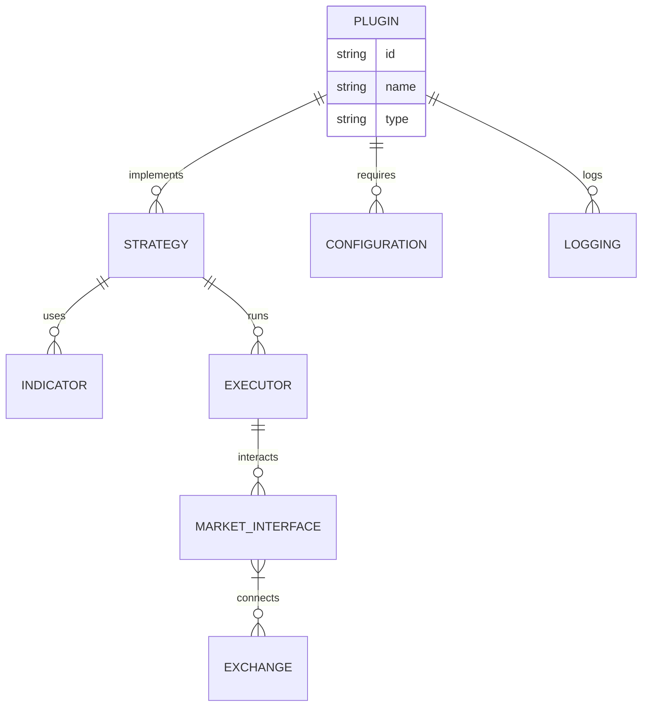

  <h1> 🤖 Qbot </h1>
</div>

<p align="left">
    
    <a href='https://github.com/MShawon/github-clone-count-badge'></a>
     <code>since Sep 26</code>
</p>

[](https://github.com/UFund-Me/Qbot/actions/workflows/codeql-analysis.yml)
[](https://github.com/UFund-Me/Qbot/actions/workflows/auto-trade.yml)
[](https://github.com/UFund-Me/Qbot/actions/workflows/pylint.yml)
<a href="https://github.com/UFund-Me/Qbot"></a>
<a href="https://ufund-me.github.io/Qbot/#/"></a>

<div align="center">
  <a href="https://github.com/UFund-Me/Qbot" target="_blank" rel="noopener">
    <picture>
      <source media="(prefers-color-scheme: dark)" alt="Qbot" srcset="https://user-images.githubusercontent.com/29084184/204598632-23c473db-92ee-4e9b-9b57-d6d95c861fdf.png" />
      
    </picture>
  </a>


<div align="center">
  <p>AI智能量化投研平台</p>
</div>

>  <b>Qbot</b> is an AI-oriented automated quantitative investment platform, which aims to realize the potential, empower AI technologies in quantitative investment. Qbot supports diverse machine learning modeling paradigms. including supervised learning, market dynamics modeling, and RL.

<p id="demo">
  <!--  -->
  
</p>

```
🤖 Qbot = 智能交易策略 + 回测系统 + 自动化量化交易 (+ 可视化分析工具)
            |           |            |            |
            |           |            |             \_ quantstats (dashboard\online operation)
            |           |             \______________ Qbot - vnpy, pytrader, pyfunds
            |           \____________________________ BackTest - backtrader, easyquant
            \________________________________________ quant.ai - qlib, deep learning strategies
```

<br>


They are:
- 🔌 Modular & reusable components
- 📦 Environment-agnostic (backtest, sandbox, live)
- 🧩 Easy to plug into any strategy or workflow
- 🌐 Exchange-agnostic with unified interfaces

Create, share, or combine plugins for indicators, strategies, risk controls, and more — all while keeping your code clean and scalable.


## Qbot Workspace

While the Qbot Platform is all about an integration to dozens of different data vendors, the interface is either Python or a CLI.

If you want an enterprise UI to visualize this datasets and use AI agents on top, you can find Qbot Workspace at.

## 支持的实盘交易接口

</img>


------

```python
import Qbot
"""
This example shows how backtest over tweets
"""

class TwitterBot(Qbot.Model):
    def main(self, args):
        while self.has_data:
            self.backtester.value_account()
            self.sleep('1h')

    def event(self, type_: str, data: str):
        # Now check if it's a tweet about Tesla
        if 'tsla' in data.lower() or 'gme' in data.lower():
            # Buy, sell or evaluate your portfolio
            pass


if __name__ == "__main__":
    exchange = Qbot.Alpaca()
    model = TwitterBot(exchange)

    # Add the tweets json here
    model.backtester.add_custom_events(Qbot.data.JsonEventReader('./tweets.json'))
    # Now add some underlying prices at 1 month
    model.backtester.add_prices('TSLA', '1h', start_date='3/20/22', stop_date='4/15/22')

    # Backtest or run live
    print(model.backtest(args=None, initial_values={'USD': 10000}))

```

## Qbot 版本说明

| 版本介绍 | 说明 | 产品与服务 | 适合人群 |
| --- | --- | --- | --- |
| public（开源版） | 当前开源仓库 | - 开源代码可自行学习，提供整个框架的闭环搭建，实现数据的获取、策略开发、指标分析等功能 | 对量化交易感兴趣的开发者、产品经理 |
| pro(专业版) | 专业付费版（年费，更新代码）  | <br />- 量化交易智库（研报复现、前沿策略探索、投研资讯））<br />- qbot_pro 包含基础版本的所有功能，并且实现AI选股、数据获取清洗、策略开发、策略回测、模拟交易、实盘自动化交易全流程闭环<br />- 封装好的接口示例、系统源码开发示例<br />- 易于开发的策略模板和因子表达式<br />- 分层架构设计，数据、策略(回测、实盘交易)中间表达。<br />- 社群答疑服务<br />- 遵循《署名-非商业性使用-相同方式共享》开放协议的其他非商业用途的二次开发<br /> | <br />- 个人量化交易员、证券交易从业者<br />- 希望快速学习量化并在股票、基金、虚拟货币实现量化交易的<br /> |
| vip   | 1对1的会员专项服务（年费，每年更新代码） | <br /><br />- 最新的量化交易系统，包含基础版本和专业版的所有软件功能 <br />- 提供封装好的基金、股票、期货、及现货和合约量化接口 （支持Binance现货、合约） <br />-  多个智能量化策略示例 <br />-  远程技术支持和服务 <br /> | <br />- 量化交易员<br />- 希望快速学习量化并在相关市场实现量化交易的<br />- 定制相关市场接口<br /> |

> [!TIP]
> 相关软件版本付费及更多信息、答疑解惑，添加微信 Yida_Zhang2

###  Optional: Run with Docker

Build and run the plugin using Docker:

```bash
docker build -t Qbot-rsi-plugin .
docker run -it --env-file .env Qbot-rsi-plugin
```




<p align="center">
    
</p>

<p align="center">
  </center>
</p>

## Contributors

 wouldn't be  without you. If we are going to disrupt financial industry, every contribution counts. Thank you for being part of this journey.

<a href="https://github.com/Qbot-finance/Qbot/graphs/contributors">
   
</a>
